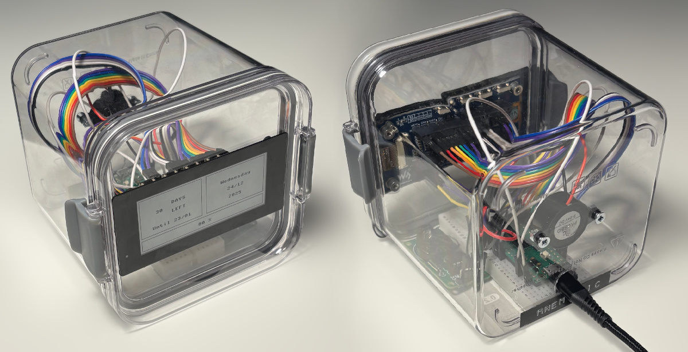

### Mnematic

A simple device that keeps you reminded about your habits and routines. Comes with a default preset for monthly contact lens changes (30-day countdown), but can be easily configured for any recurring habit.



#### Hardware components

- Raspberry Pi Pico (RP2040) - running **MicroPython**
- E-paper - 2,9'' 296x128px - SPI/I2C - B&W - Waveshare 20051
- Buzzer w/ Generator FY248 23mm 3-24V
- Real Time Clock - DS1302 RTC

#### Libraries

Place the library files in the `lib/` folder on the Pico before running the main program. This project uses three external libraries:

- **Real Time Clock** - `ds1302.py`  
  Author: shaoziyang, Omar BENHAMID  
  License: MIT License  

- **E-paper** - `Pico_ePaper_2_9.py`  
  Author: Waveshare team  
  License: MIT License  

- **Touch** - `icnt86.py`  
  Author: Waveshare team  
  License: MIT License  

### Pinout

```
                         ┌─────────────────┐
                         │    ╔══USB══╗    │
                  GP0  ──┤ 01 ║       ║ 40 ├── VBUS
                  GP1  ──┤ 02 ║       ║ 39 ├── VSYS ------- eInk (Input Voltage)
                  GND  ──┤ 03 ║       ║ 38 ├── GND       
  eInk (KEY0)---  GP2  ──┤ 04 ║       ║ 37 ├── 3V3_EN
  eInk (KEY1)---  GP3  ──┤ 05 ║       ║ 36 ├── 3V3(OUT) --- eInk (Input Voltage)
                  GP4  ──┤ 06 ║       ║ 35 ├── ADC_VREF
                  GP5  ──┤ 07 ║       ║ 34 ├── GP28 
                  GND  ──┤ 08 ║       ║ 33 ├── GND
  eInk (TP_SDA)-  GP6  ──┤ 09 ║       ║ 32 ├── GP27 
  eInk (TP_SCL)-  GP7  ──┤ 10 ║       ║ 31 ├── GP26 
  eInk (DC)-----  GP8  ──┤ 11 ║       ║ 30 ├── RUN -------- eInk (Reset Button)
  eInk (CS)-----  GP9  ──┤ 12 ║       ║ 29 ├── GP22 ------- Buzzer (SIG)  
                  GND  ──┤ 13 ║       ║ 28 ├── GND -------- Buzzer (GND)
  eInk (CLK)----  GP10 ──┤ 14 ║       ║ 27 ├── GP21     
  eInk (DIN)----  GP11 ──┤ 15 ║       ║ 26 ├── GP20 ------- RTC (RST)
  eInk (ERST)---  GP12 ──┤ 16 ║       ║ 25 ├── GP19 ------- RTC (DAT)
  eInk (BUSY)---  GP13 ──┤ 17 ║       ║ 24 ├── GP18 ------- RTC (CLK)
  eInk (GND)----  GND  ──┤ 18 ║       ║ 23 ├── GND -------- RTC (GND)
                  GP14 ──┤ 19 ║       ║ 22 ├── GP17 ------- eInk (TP_INT)
  eInk ---------  GP15 ──┤ 20 ║       ║ 21 ├── GP16 ------- eInk (TP_TRST)
                         │    ╚═══════╝    │
                         └─────────────────┘
                              
```

#### Setup

1. Install MicroPython on your Raspberry Pi Pico
2. Place the library files in the `lib/` folder
3. Upload `main.py`, `next_deadline.json` and `deadline_archive.txt` to the Pico
4. Connect hardware according to the pinout diagram above
5. Set the initial deadline/habit name in `next_deadline.json`:

```json
   {"habit": "Changing Lenses", "date": "2025-01-30"}
```
